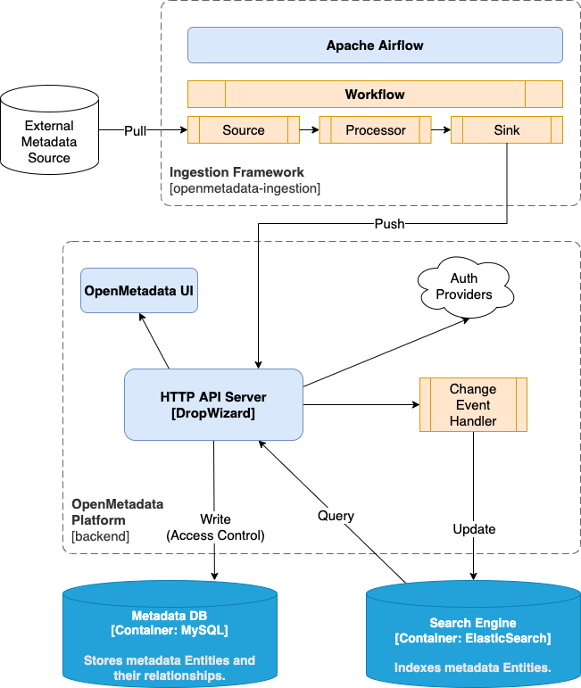

# 🗂️ Metadata Manager


---

## 🧩 Overview

**Metadata Manager** is a lightweight and extensible tool for managing, validating, and organizing metadata for datasets, files, or other digital assets.  
It helps ensure data consistency, makes schema management easier, and provides a structured approach to storing metadata.


---

## 🚀 Features

- 📦 Define and manage **custom metadata schemas**  
- ✏️ Perform **CRUD operations** on metadata records  
- 🧠 Validate metadata against defined schemas  
- 🔗 Support for **multiple backends** (e.g., JSON, SQLite, PostgreSQL)  
- ⚙️ Easily **extendable** for custom integrations and data types  





---

## 🧰 Getting Started

### 📋 Prerequisites

Make sure you have the following installed before proceeding:

- **Python 3.8+**  
- **pip** package manager  
- (Optional) **virtual environment** for isolation

---

### ⚙️ Installation

Clone the repository and install dependencies:

```bash
git clone https://github.com/Meet2197/metadata_manager.git
cd metadata_manager
```

### (Optional) create a virtual environment
```bash
python -m venv venv
source venv/bin/activate  # macOS/Linux
venv\Scripts\activate     # Windows
```
### Install dependencies
```bash
pip install -r requirements.txt
```

# 🔧 Configuration

You can configure the project by editing the config.yaml file or creating a .env file.

Example config.yaml:

```bash
database:
  type: sqlite
  path: ./data/metadata.db

schema:
  directory: ./schemas
```

# 🧠 Usage

```bash
Run the metadata manager from the command line.
```
Initialize metadata storage
```bash
python manage.py init
```

Create a metadata record
```bash
python manage.py create --schema user --data user1.json
```

List all metadata records
```bash
python manage.py list --schema document
```

Update a metadata record
```bash
python manage.py update --id 123 --data update.json
```

Delete a metadata record
```bash
python manage.py delete --id 123
```

(Adjust commands to match your CLI interface if needed.)

### 📁 Example
Example Schema (schemas/user_schema.json)
```bash
{
  "schema": "user",
  "fields": [
    { "name": "id", "type": "integer" },
    { "name": "name", "type": "string" },
    { "name": "email", "type": "string" },
    { "name": "created_at", "type": "datetime" }
  ]
}
```

Example Metadata Record (data/user1.json)
```bash
{
  "id": 1,
  "name": "Alice Smith",
  "email": "alice@example.com",
  "created_at": "2025-11-12T10:00:00Z"
}
```

# 🧱 Project Structure

```bash
metadata_manager/
├── bin
├── manage.py
├── requirements.txt
├── metadata_manager/      # Project settings
├── metadata/              # Main app
│   ├── models.py         # Data models
│   ├── views.py          # View logic
│   ├── forms.py          # Forms
│   ├── urls.py           # URL routing
│   └── admin.py          # Admin interface
│ templates/            # HTML templates
│ static/    
├── setup.sh
```

# 🧪 Testing

To run unit tests (if available):
```bash
pytest
```

You can also use tox or other testing frameworks if configured.

# 🤝 Contributing

Contributions are welcome! To get started:

Fork the repository

Create a feature branch
```bash
git checkout -b feature/your-feature-name
```

Make your changes and commit them
```bash
git commit -m "Add your feature description"
```

Push your branch
```bash
git push origin feature/your-feature-name
```

Open a Pull Request

Please make sure your code follows existing style conventions and includes documentation/tests for new features.

# 🧾 License

This project is licensed under the MIT License.
See the LICENSE
 file for details.

# 📬 Contact

For feedback, questions, or collaborations:

GitHub: @Meet2197

Repository: Metadata Manager

# ⭐ Support

If you find this project helpful, consider giving it a ⭐ on GitHub to show your support!

✨ Built with care to make metadata management simple, scalable, and developer-friendly.
